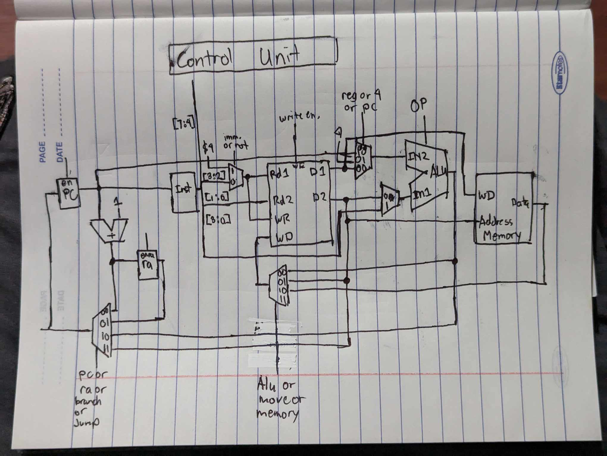

## Specs
8-bit cpu. Made using my imagination

## Datapath
Here is the hand drawn datapath.


## Registers
- `$1` (00)- General Purpose
- `$2` (01)- General Purpose
- `$3` (10)- General Purpose
- `$4` (11)- Used for load upper and loader lower. Can also be used as general purpose
- `$pc` - program counter. Special Purpose. 
- `$ra` - return address. Special Purpose

## Memory 
Memory is addressable by 2**8 = 256 bytes. Each operations are 1 bytes each and is stored from memory address 0. Address 253 to 256 are for memory mapped io. (these 3 bytes are for uart port)

## I/O
There are 2 io device. One is a uart transmitter, the other is an led.
- Led address - 251
- Uart Addresses
    - DataOutBuffer Register - 252
    - DataInBuffer register - 253
    - Control Register - 254
    - Status Register - 255

## Instruction Sets
|    | Opcode       | PseudoCode            | Assembly             | Description                                                                                                               |
|----|--------------|-----------------------|----------------------|---------------------------------------------------------------------------------------------------------------------------|
| 1  | [0000 0000]  | Halt                  | Halt                 | Halt                                                                                                                      |
| 2  | [0001 xxxx]  | $4 = xxxx0000         | lagay_itaas xxxx     | load upper immidiate xxxx to register $4. Clear the lower bits. Works by shifting the immidiate by 4 and storing it to $4 |
| 3  | [0010 xxxx]  | $4 = $4 \| xxxx       | lagay_ibaba xxxx     | load lower immidiate xxxx to register $4. Similar to oring the $4 register with the immidiate                             |
| 4  | [0011 xx yy] | xx = mem[yy]          | basa_mula_mem xx, yy | read from memory address in register yy to xx                                                                             |
| 5  | [0100 xx yy] | mem[yy] = xx          | lagay_sa_mem  xx, yy | store to memory address in register yy from value of xx                                                                   |
| 6  | [0101 xx yy] | xx = yy               | lipat xx, yy         | move value of register yy to xx                                                                                           |
| 7  | [0110 xx yy] | xx = yy + xx          | dagdag xx, yy        | add yy to xx store value to xx. Can set zero                                                                              |
| 8  | [0111 xx yy] | xx = ~(yy & xx)       | hindi_tsaka xx, yy   | nand yy to xx store value to xx.                                                                                          |
| 9  | [1000 xx yy] | xx = yy & xx          | tsaka xx, yy         | and yy to xx store value to xx                                                                                            |
| 10 | [1001 xx yy] | xx = yy \| xx         | o_kaya xx, yy        | or yy and xx store value to xx                                                                                            |
| 11 | [1010 xx yy] | xx = yy ^ xx          | xor xx,yy            | xor yy and xx store value to xx. Can set the zero flag.                                                                   |
| 12 | [1011 00 xx] | call xx               | tawag xx             | jump to address register xx                                                                                               |
| 13 | [1100 00 xx] | if(zero) call xx      | tawag_kung_zero xx   | jump to address register xx if zero flag is set                                                                           |
| 14 | [1101 00 xx] | $pc = $ra             | balik                | return. Set $pc to $ra                                                                                                    |
| 15 | [1110 xxxx]  | if(zero ) $pc += xxxx           | sanga_kung_zero_unsigned xxxx           | branch to address offset xxxx if zero flag is set                                                                                             |
| 16 | [1111 xxxx]  | if(zero ) $pc += xxxx | sanga_kung_zero_signed xxxx | branch to address offset signed xxxx if zero flag is set                                                                         |

Alu Op
```
000 - None zero output. Zero flag 1
001 - Add
010 - Shift right
011 - nand
100 - and
101 - or
110 - xor
```